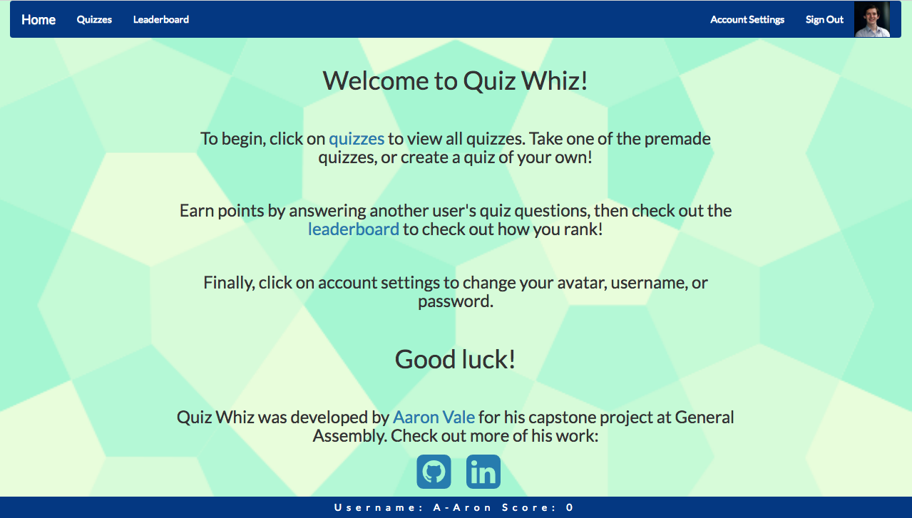
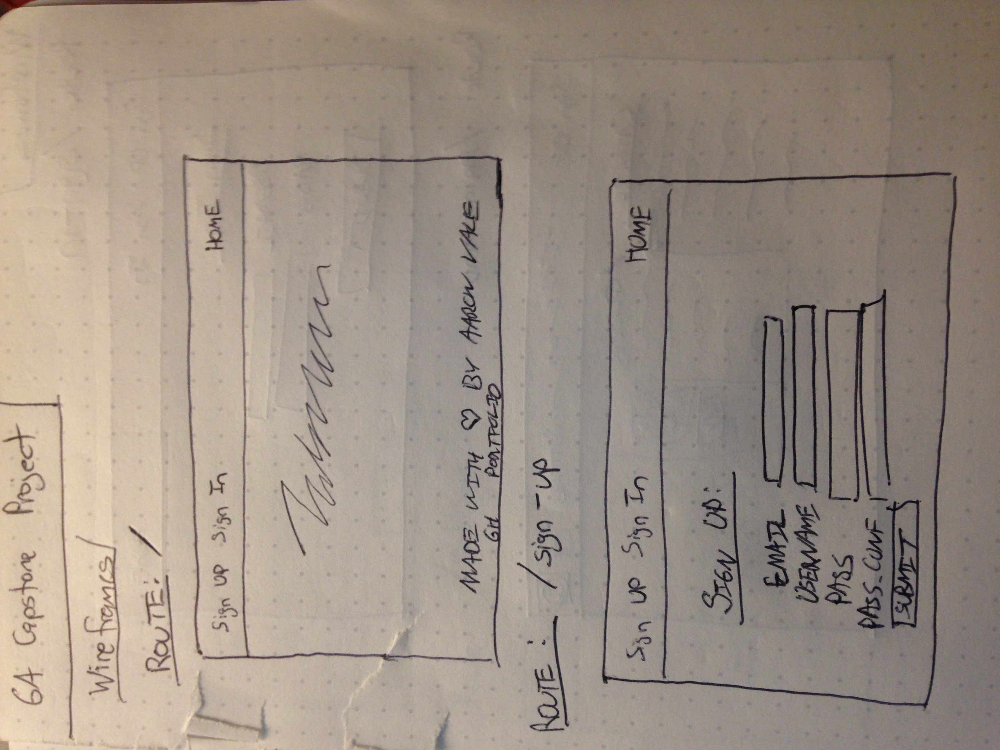
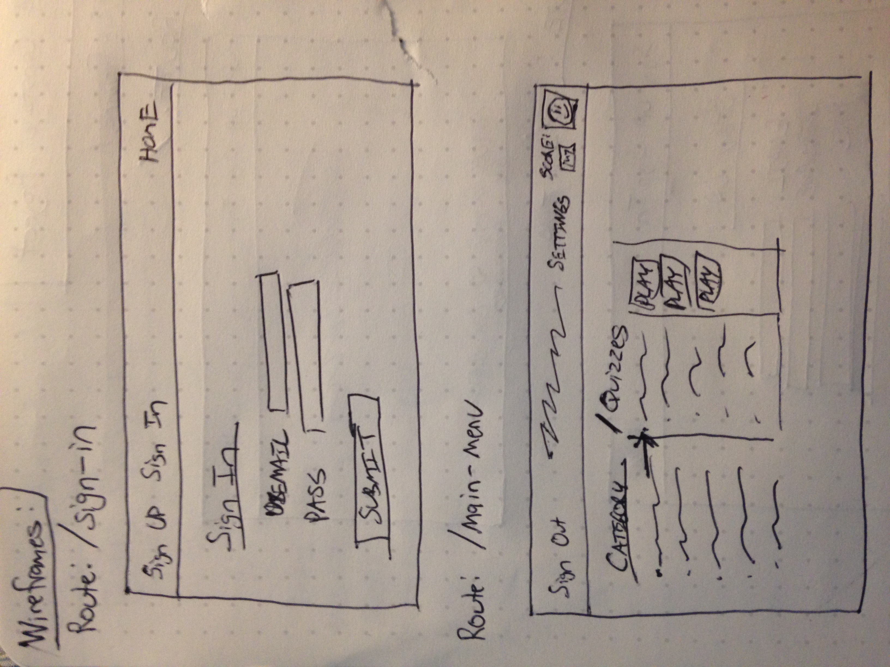
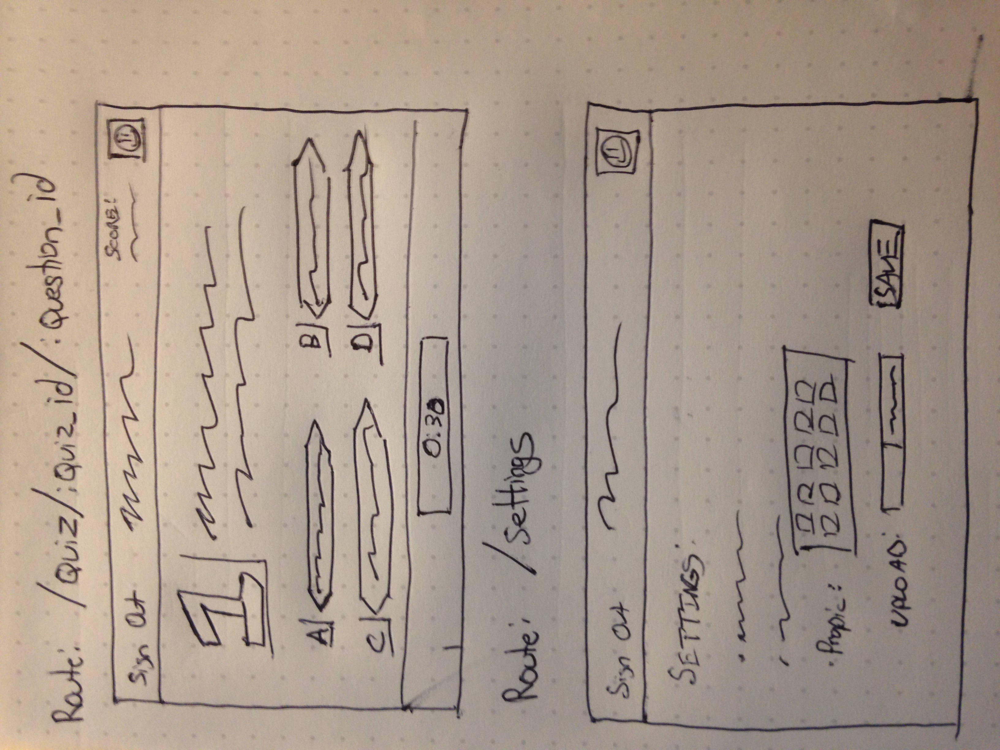

# Quiz Whiz

## Capstone project for General Assembly

### Introduction

Quiz Whiz is an Ember.js application for users to create and share quizzes. Users can register for an account and earn points by taking other user's quizzes. The users with the highest scores can earn their spot at the top of the leaderboard.

Link to Ruby on Rails Back-End Repository: https://github.com/Aaron-Vale/Capstone-Back-End
Link to Deployed Front-End: https://aaron-vale.github.io/quiz-whiz/
Link to Deployed Back-End: https://intense-harbor-78867.herokuapp.com/

### Technologies Used

HTML, SASS, Ember.js

### User Stories

The following were my original user stories before development started:

Basic:

1.  [ ]  As a user, I can sign up, sign in, change password, and sign out.
1.  [ ]  As a user, I can select a profile image.
1.  [ ]  As a user, I can select a quiz and answer questions of a specified category.
1.  [ ]  As a user, I am able to see the correct answer after I submit a response.

Reach:

1.  [ ]  As a user, I can earn points by selecting correct answers. Answering correctly faster will earn more points.
1.  [ ]  As a user, I can earn achievements, which unlock additional functionality
1.  [ ]  As a user, I can compare my scores with friens and view the scores on a leaderboard.

### Original Wireframes:

### Planning, Process and Problem-Solving Strategy

Using Ember.js for this project presented a great challenge. It was my first time utilizing a front-end framework, so it was difficult to plan exactly what shape my app should take. Having only a week to complete the project, as well as the uncertainty about what kind of features I might be capable of building, I separated my user stories into basic and reach categories. I planned to complete all of the basic user stories first, and then to try and implement as many reach user stories as possible.

I began on the back-end, designing a basic entity relationship structure and testing my API endpoints. When I was ready to move on to the front end, I began by building out my routes as well as my models, so I could begin to interact with the API. I started by building out components to create new quizzes, and then to populate those quizzes with questions. Once a user could create new quizzes and questions, I added the ability to update and delete quizzes and questions.

In order to complete my user stories, however, I needed additional functionality when it came to my Users resource. I added in the ability for users to choose a unique username when they sign up for the app, as well as the ability to change this username later. Originally I wanted to implement a feature for users to upload their own image to set it as their avatar, but due to time constraints, I had to settle for a backup plan-- having the users enter the URL of an image hosted elsewhere on the Internet.

Once I had the user profile functionality in place, I then set out to make the app into more of a game. I added actions that check if an answer is correct or incorrect after a user clicks on an answer, assigned point values to questions, gave users the ability to choose how many points a question should be worth when they create a question. Finally, I added logic to add or subtract the number of points assigned to the question, and save the results to a user's profile. This proved to be the greatest challenge of development, since I had to make sure that a user could not earn points from answering their own questions, or from answering a question for the second time.

Learning the patterns of development for a front-end framework like Ember was quite challenging, and often frustrating, but by the end I was able to fully appreciate the power of breaking up the front end into components, as well as handling routing on the front end.

#### Future Additions

In the future, I'd like to implement a file upload feature that integrates with Amazon Web Services, as well as building out the rest of my 'reach' user stories, including additional game modes such as a 'Who Wants to Be A Millionaire'-style mode.
